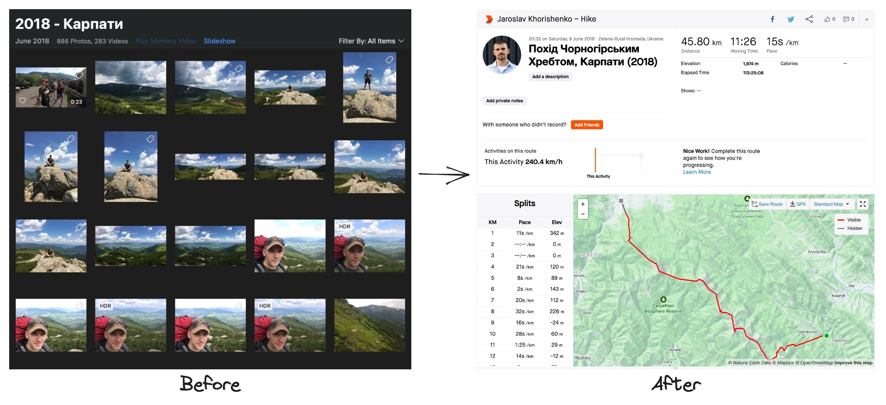

# Img to Map CLI Tool


`img-to-map` is a command line tool for generating GPX (GPS Exchange Format) files from images that contain GPS data. The tool uses [ExifTool](https://exiftool.org/) to extract the geographical coordinates from your photos and create a GPX track from them.



GPX is a widely accepted data format that allows for the sharing and visualizing of GPS data across a variety of platforms and services. Once you've generated a GPX file with `img-to-map`, you can upload it to platforms such as [Strava](https://strava.com/) or [Google Maps](https://www.google.com/maps), or use other tracking services or map software that supports the GPX format. This opens a plethora of possibilities, including analyzing your journey, sharing your travel routes with others, or re-living your adventures.

## Installation

Before using `img-to-map`, you need to have [ExifTool](https://exiftool.org/) installed on your system.

Installation:

```bash
npm install -g img-to-map
```

Or by using [npx](https://www.npmjs.com/package/npx):

```bash
npx img-to-map
```

## Usage

```bash
img-to-map [options]
```

The tool is configurable with the following options:

| Option           | Description                                                   | Default Value |
|------------------|---------------------------------------------------------------|---------------|
| `-v, --version`  | Output the current version                                    | N/A           |
| `-n, --name`     | Set the track name                                            | "My Track"    |
| `-t, --type`     | Set the track type                                            | "hiking"      |
| `-f, --folder`   | Specify the folder with photos                                | N/A           |
| `-o, --output`   | Specify the output file                                       | "track.gpx"   |
| `--split-by-days`| Split each day into a separate file                           | N/A           |
| `--debug`        | Output extra debugging information                            | N/A           |
| `-h, --help`     | Display help for command                                      | N/A           |

## Examples

### Generate a GPX track with default settings:

To generate a GPX track file with the default settings, you only need to specify the folder with your photos:

```bash
img-to-map --folder /path/to/photos
```

The tool will generate a GPX file named `track.gpx` in the current directory. The track will have the name "My Track" and the type `hiking`.

### Generate a GPX track with custom settings:

To customize the output, you can use any of the available options. For example, you can set a custom track name and output file:

```bash
img-to-map --name "My Vacation" --folder /path/to/photos --output "vacation.gpx"
```

This will generate a file named `vacation.gpx` with the track name "My Vacation".

### Split tracks by days:

If you have photos from multiple days and you want to generate a separate track for each day, you can use the `--split-by-days` option:

```bash
img-to-map --folder /path/to/photos --split-by-days
```

The tool will generate a separate GPX file for each day.

### Debugging:

If you encounter any problems or need to get more information about what the tool is doing, you can enable debugging output with the `--debug` option:

```bash
img-to-map --folder /path/to/photos --debug
```

## Help

For more information about the available options, you can use the `--help` command:

```bash
img-to-map --help
```

This will display a summary of the available options and their descriptions.

## Contacts

Jaroslav Khorishchenko

[hello@husky-dev.me](mailto:hello@husky-dev.me)
